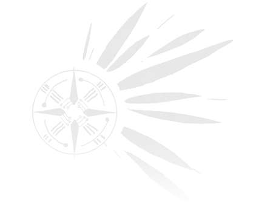

# Roya Tribe emblem: verified official source

Verified 2026-10-04. Scope: Roya Tribe only; no production edits.

## Accepted source

- Official site: https://wutheringwaves.kurogames.com/en/main
- Official site's asset index: https://wutheringwaves.kurogames.com/static4.0/assets/index-3a7e0d27.js
- Exact native asset URL: https://wutheringwaves.kurogames.com/static4.0/assets/logo-lyr-big-03ab933c.webp
- Asset variable in official JavaScript: `logoLyrBig`.
- Original dimensions: **422 x 344 pixels**, **26,642 bytes**, WebP, sRGB RGBA.
- Transparent background: yes. Sharp metadata reports `hasAlpha: true`; decoded alpha has minimum 0 and maximum 106/255. This is an intentionally faint official background/logo version, with a distressed/grain texture. Do not describe it as an opaque pristine white emblem.
- SHA-256: `03ab933c924da62c918903527a22bc68276a5d0c503fde9e8b858e792a0aa921`.
- Attribution/provenance: existing Wuthering Waves official website artwork; copyright Kuro Games. Downloaded unchanged from the official domain. No generated/reconstructed linework, interpolation, silhouette tracing, or screenshot enlargement.

## Local visual verification

First inspected the user reference `C:/Users/莫名/AppData/Local/Temp/codex-clipboard-826796be-5138-4be6-af71-b02df7e5f9ff.png` with `view_image` (the reference includes the Chinese label 罗伊族). Then inspected the official downloaded WebP at its original 422 x 344 size with `view_image`.

The circular spoked wheel on the left and pointed feather/ray fan on the right match the reference. The native asset has no Chinese label and is suitable for decorative use. Tiny flecks and pale alpha are part of the downloaded official artwork.

Local verification image (unchanged original, not an enlarged screenshot):

Research copy: `.trellis/tasks/10-04-handbook-faction-emblems/research/assets/roya-official-native.webp`.
Implementation handoff copy: `.tmp/handbook-factions/logo-lyr-big-03ab933c.webp`.

## Presentation implications

Native 422 x 344 resolution exceeds the requested 256 px source threshold. Retain its aspect ratio using a contained roughly square frame. As the source itself already peaks at ~42% alpha, multiplying it by a very low CSS opacity will make it disappear; evaluate the actual paper background before selecting final decorative opacity. No asset processing was done by this research subagent.

## Search trace / rejected sources

- Game8 https://game8.co/games/Wuthering-Waves/archives/556889 indexes a “Wuthering Waves Roya Tribe Sigil” image, but direct HTML returned CloudFront 202 with an empty body/WAF challenge. No extracted image was used.
- Fandom https://wutheringwaves.fandom.com/wiki/Roya_Tribe was indexed by web search, but direct HTML returned 403 and web open was restricted. No Fandom image was used.
- BWIKI public `allimages` requests for the exact Roya names returned 567 security pages in this environment. No BWIKI source was used.
- Official Sigrika anecdotes image https://hw-media-cdn-mingchao.kurogame.com/object/1773331200000/nt5jqoluhi9e33nh55-1773393957955.jpg was downloaded at native 1080 x 3980 and visually inspected; it did not provide the desired isolated emblem.
- Commercial fan emblem artwork was rejected; it is unnecessary now that the exact native official site asset is available.

Discovery benefited from the parallel Startorch official-logo bundle finding. The same official JavaScript contains `logoLyrBig`, making the source consistent with the other two approved faction assets.
