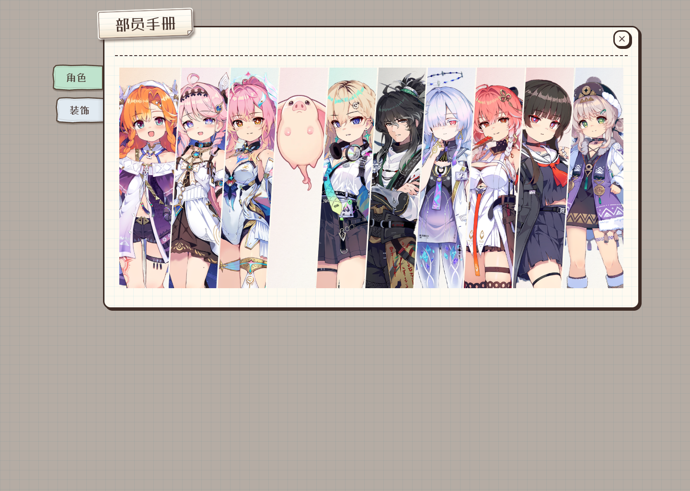
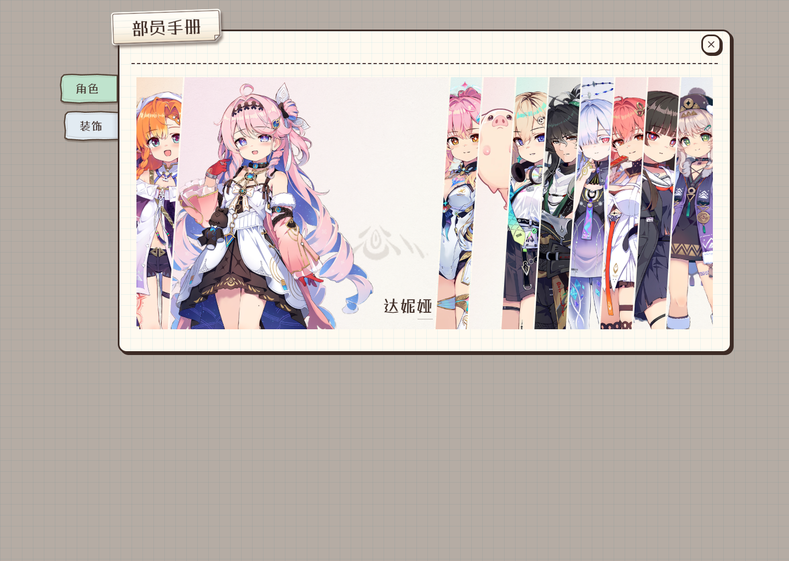
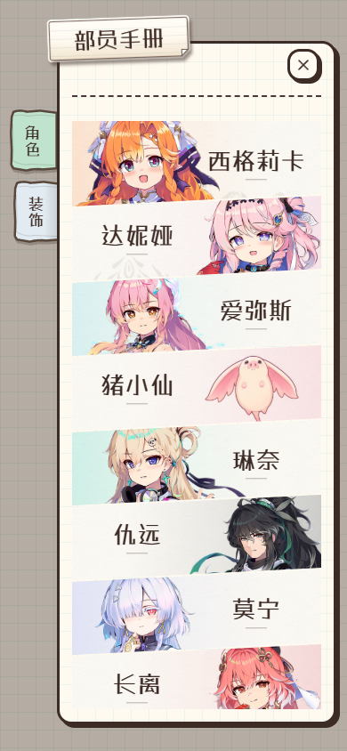

# 部员纪念册纸面精修

当前正式 `HouseCharacterGrid` 的视觉精修，替换斜切条带原来的大面积平色。截图来自真实组件夹具，不含额外设计样板逻辑。

- 桌面：人物侧的主题色逐渐褪向纸白，保留自然纸纤维；展开后的服饰印花位于留白处，姓名作右下落款。
- 手机：人物继续左右交错，渐变方向随站位改变，姓名保持对侧大字和透明背景，印花更小。
- 首批印花只取西格莉卡、达妮娅、娜波摩提供立绘中的真实衣服图案；其他角色先使用纸纹与主题渐变。素材来源和可复现提取脚本见 `public/assets/characters/handbook-ornaments/manifest.json`。
- 未拥有角色不加载印花，不显示姓名，继续静态灰色剪影和对侧问号；未知猪小仙保持“暂无情报”。人物比例、裁切、事件和详情逻辑由既有组件控制。

## 当前桌面静态（1440×1024）

## 桌面展开达妮娅（1440×1024）

## 手机静态（390×844）

截图生成过程也检查了1440×768和360×640、部分拥有状态及手机最后一行；四种视口无横向溢出和页面异常。现有手册浏览器回归15/15通过，覆盖直接详情、触摸恢复、固定头像尺寸、单向移动与未拥有静态行为；相关组件／样式检查、lint、构建和生产CSS检查均通过。

本地组件预览：`http://127.0.0.1:5299/tests/e2e/fixtures/handbook-puzzle.html`；追加 `?owned=partial` 查看部分拥有状态。
